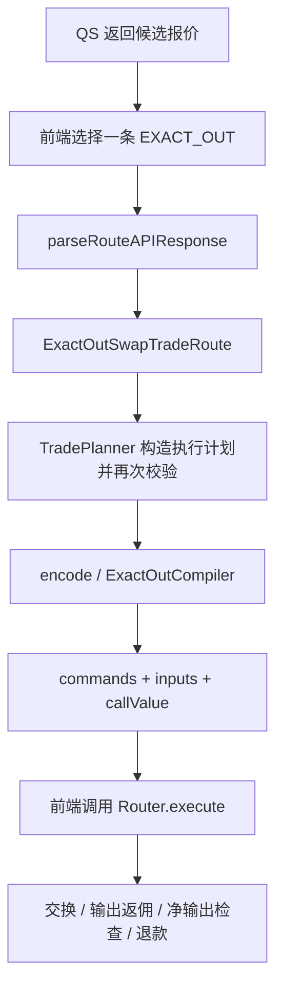

# SDK Exact-Out 实现说明

本文对应 `feature/native-exact-out` 当前实现，更新于 2026-09-23。说明 QS 报价如何转换为 Universal Router 命令，以及付款、输出返佣和退款的实际行为。本文替代原整体设计与返佣设计文档，仅描述当前实现。

## 1. 目标与职责

Exact-Out 以净输出目标和最大输入预算约束交易。SDK 编码协议原生 Exact-Out 命令，池子或 Router 在链上确定实际所需输入；SDK 不用多段 Exact-In 模拟 Exact-Out，也不重新计算各跳报价。

- **QS**：提供候选路径、预计输入、最大输入、净输出、毛输出及输出返佣费率。
- **前端**：选择一条报价，指定收款人与返佣项目，准备授权，向匹配的 Router 发送交易。
- **SDK**：解析报价、检查准入、分段，生成交换、包装、分佣、输出检查和退款命令。
- **Router / 池子 / Permit2 / ReferralVault**：执行交换与扣款，分发输出和退款，收取并记账返佣。

SDK 不查询链上余额、授权、池状态或部署版本，也不签名、广播交易。编码成功不等于报价可执行。

在 Router 没有历史余额干扰、代币转账行为与协议兼容的前提下，成功交易应使用户得到**不少于净目标**的输出，交换输入不超过最大预算。输出可能因取整或整余额分发而多于目标，不保证严格相等。网络手续费不包含在交换预算中。

## 2. 前端调用流程



`parseRouteAPIResponse` 接收一条 `RouteData`，不是整个响应或候选数组。Exact-Out 必须显式传入 `tradeType: 'EXACT_OUT'`；省略时按 Exact-In 处理。

```typescript
import {
  Address,
  TradePlanner,
  parseRouteAPIResponse,
  type ExactOutRouteData,
} from '@sun-protocol/universal-router-sdk'

function encodeExactOut(
  quote: ExactOutRouteData,
  isTestnet: boolean,
  recipient?: string,
  referralProject?: string,
) {
  const route = parseRouteAPIResponse(quote, isTestnet)
  if (recipient) route.recipient = new Address(recipient)

  if (route.outputReferralBips > 0 && !referralProject) {
    throw new Error('Output referral requires a project address')
  }

  const planner = new TradePlanner([route], false, {
    referralOptions: route.outputReferralBips > 0
      ? { mode: 'output', bps: route.outputReferralBips, projectAddress: referralProject! }
      : undefined,
  })
  planner.encode()
  return { route, commands: planner.commands, inputs: planner.inputs, callValue: planner.callValue }
}
```

前端将结果传给已选定的 Router：

```typescript
// encoded 为上面 encodeExactOut 的返回值；router 为 TronWeb 合约实例。
// deadline 为前端选择的 Unix 秒级截止时间。
if (encoded.callValue > BigInt(Number.MAX_SAFE_INTEGER)) {
  throw new Error('callValue exceeds the client safe integer range')
}
await router.execute(encoded.commands, encoded.inputs, deadline).send({
  callValue: Number(encoded.callValue),
})
```

注意：

- `isTestnet` 影响 TRX/WTRX 币对识别，不会自动选择 Router 或校验部署。
- Exact-Out 拒绝 `slippage`、`slippageBips` 覆盖，即使传入零；最大输入直接使用 QS 报价。
- 仅接受一条路由；不能启用 `tradeSpiltOptions.enable` 或 `oneShotTransfer`。
- 在创建 Planner 前设置好路由；每笔交易新建 Planner，调用一次 `encode()`。重复调用会追加命令。
- Exact-Out 编码失败会恢复本次编码前的 `commands` 和 `inputs`；这不是链上回滚机制。
- 输出与退款都发给 `recipient`，省略时使用 `MSG_SENDER`。付款人仍是交易发送者。

## 3. 报价与内部金额

类型见 [routeAPI.ts](../src/types/routeAPI.ts) 和 [route.ts](../src/types/route.ts)。Raw 金额为十进制整数字符串，解析后为最小单位 `bigint`。

| QS 字段 | 内部字段 | 用途 |
| --- | --- | --- |
| `amountInRaw` | `amountIn` | QS 预计输入，用于预算一致性、PSM 精度检查，以及纯解包的拉款金额；不是一般交换的实际扣款结果 |
| `amountInMaximumRaw` | `maximumAmountIn` | 最大输入；TRX 输入时也是 `callValue` |
| `amountOutRaw` | `amountOut` | 扣佣后的净输出目标，作为最后输出 SWEEP 的最低余额 |
| `grossAmountOutRaw` | `grossAmountOut` | 交给协议交换命令的毛输出目标 |
| `amountOutReferralBips` | `outputReferralBips` | 输出收费比例，省略为零 |
| `amountInReferralBips` | 不保留 | 只用于拒绝非零输入收费比例 |

`ExactOutSwapTradeRoute` 不提供 `minimumAmountOut` 或嵌套的 `exactOut` 金额对象。前端展示“至少得到”应读取 `route.amountOut`。

`amountIn`、`amountOut`、`amountInMaximum` 等格式化字符串及公共 `stepAmountsOut` 仍属于 QS 类型，但不参与 Exact-Out 金额编码。SDK 不读取 `stepAmountsInRaw`、`stepAmountsOutRaw`、逐跳 execution mode，也不读取 `amountInRawReferral`、`amountOutRawReferral`。

预算检查中，设 QS 预计输入为 `Q = amountIn`，最大输入为 `M = maximumAmountIn`：

```text
M >= Q > 0
```

毛输出一致性检查中，设净目标为 `N = amountOut`，毛目标为 `G = grossAmountOut`，输出费率为 `b = outputReferralBips`，基数为 `D = 10000`：

```text
0 <= b < D，且 b 为整数
G - floor(G × b / D) >= N > 0
```

SDK 用这一关系检查报价能否覆盖净目标，不要求毛目标是满足条件的最小值，也不会将计算结果作为固定佣金传给合约。

## 4. 路径解析与准入

解析入口见 [parseRouteAPIResponse.ts](../src/core/parseRouteAPIResponse.ts)，路由准入见 [exactOut.ts](../src/core/exactOut.ts)。手工构造的路由也会在生成执行计划时接受准入检查。

报价需满足：

- 至少一跳；`tokens.length = poolVersions.length + 1`。
- `poolKeys.length = poolVersions.length`；非 V4 跳可填 `null`。
- `poolFees` 至少包含每跳费用，多出的展示条目不参与编码。
- 支持的版本字符串为 `v1`、`v2`、`v3`、`v4`、`usdt20psm`、`wtrx`。
- 当前网络 TRX/WTRX 币对优先识别为包装，即使标为 `v2`、`v3`、`v4`；但任意未知版本并不会因此被接受。
- 地址接受 Base58Check、20 字节 `0x` 格式或带 `41` 前缀的 TRON hex；Exact-Out 做格式与 Base58 checksum 校验。
- V4 PoolKey 的 token0/token1 必须与该跳排序后的币对一致；使用 PoolKey 中的 fee、hooks、parameters。

执行路由要求池连通、币对顺序正确、最后币种匹配输出，并拒绝重复池。重复身份使用协议与币对，V3 增加 fee，V4 再增加 hooks 与 parameters，不查询真实池地址。

| 路由 | 当前准入与编码 |
| --- | --- |
| V1 | TRX→Token、Token→TRX、Token→Token；可显式写 Token→TRX→Token，编码只保留端点 |
| V2 / V3 | 同一协议单跳或多个不同池；原生 TRX 需经 WTRX 转换 |
| V4 | 同一协议单跳或多跳；可直接使用原生 TRX |
| PSM | 单跳、`PoolFlag.PSM`，带下面的固定精度关系检查 |
| 纯包装 | 单跳 TRX→WTRX 或 WTRX→TRX |
| 包装 + 交换 | 允许入口 TRX→WTRX、出口 WTRX→TRX；不允许中途包装 |
| 混合协议、拆单、Stable、HTX Sun | Exact-Out 拒绝 |

V1 显式中间币仅能为 TRX，最多两个 V1 池；端点式 Token→Token 的内部 TRX 桥由合约执行。SDK 支持仍要求 Router 部署提供对应命令。

输出收款标记不能为零地址或 `ADDRESS_THIS`。该检查不查询实际 Router 地址，前端应提供真实的外部收款地址。

### 金额宽度

输入与输出还需满足命令编码宽度：净目标不超过 `uint160`；ERC20 最大输入不超过 `uint160`；原生最大输入一般不超过 `uint256`。V3 毛输出不超过 `int256` 正数上限；V4 毛输出不超过 `int128` 正数上限，最大输入不超过 `uint128`。其他基础金额使用 `uint256` 范围。

### PSM 精度限制

设 QS 预计输入为 `Q = amountIn`，毛输出为 `G = grossAmountOut`，当前实现使用固定精度比 `R = 10^12`，接受以下任一关系：

```text
G = Q × R
或
Q % R = 0 且 G = Q / R
```

SDK 不在准入中写死 USDD、USDT 或 PSM 合约地址；命令携带 flag，由 Router 所用的注册配置选择池。上述关系不是对真实部署、方向或实时费率的链上验证。即使合约能对非整除目标向上取整，当前 SDK 仍会拒绝不符合该关系的报价。

## 5. 命令编译与各协议差异

[buildExecutionFromRoute.ts](../src/core/buildExecutionFromRoute.ts) 将相邻同协议池组成 section。[TradePlanner.ts](../src/core/TradePlanner.ts) 按交易类型分发，[compileExactOut.ts](../src/core/compileExactOut.ts) 负责 Exact-Out 命令，Exact-In 仍由自己的编译器处理。

整体顺序为：

```text
可选 PERMIT2_PERMIT
→ 纯解包需要的 PERMIT2_TRANSFER_FROM
→ 按 section 执行包装 / 协议交换 / 解包
→ 可选 PAY_REFERRAL（最终输出币种）
→ SWEEP（输出币种，recipient，净目标）
→ 适用的剩余 WTRX 解包与输入退款
```

这些支付和清理命令由 SDK 添加，QS 不提供命令列表。`commands` 保存命令字节，`inputs` 保存对应 ABI 参数；通过一次 `Router.execute(bytes,bytes[],uint256)` 执行。

下表中，`G` 是当前毛输出目标 `grossAmountOut`，`M` 是最大输入 `maximumAmountIn`，`THIS` 表示 `ADDRESS_THIS`：

| 协议 | 交换命令与路径 |
| --- | --- |
| V1 | `V1_SWAP_EXACT_OUT(THIS, G, M, [input, output], payerIsUser)`；合约内部完成 TRX 桥 |
| V2 | `V2_SWAP_EXACT_OUT(THIS, G, M, 正向地址路径, payerIsUser)` |
| V3 | `V3_SWAP_EXACT_OUT(THIS, G, M, 反向 bytes 路径, payerIsUser)`；token 与 fee 一起反转 |
| PSM | `PSM_SWAP_EXACT_OUT(THIS, G, M, 正向地址路径, flags, payerIsUser)` |
| V4 | 外层 `V4_SWAP` 内含 Exact-Out swap、settle、take actions |

`payerIsUser` 为真需满足：交换 section 是第一个 section，且其输入不是原生币。存在入口包装时，交换由 Router 支付。

### V4 路径与结算

单跳使用 `CL_SWAP_EXACT_OUT_SINGLE`，包含 PoolKey、方向、毛目标、最大输入。多跳使用 `CL_SWAP_EXACT_OUT`：`currencyOut` 是最终输出；path 按正向池顺序构造，每项 `intermediateCurrency` 填该跳的正向输入币种，由配套 Router 逆序遍历。

交换之后，付款方式决定结算 action。下表中 `M` 表示最大输入 `maximumAmountIn`，`OPEN_DELTA` 表示读取当前未结算 delta：

| 付款方式 | Action | 含义 |
| --- | --- | --- |
| 用户 ERC20 付款 | `SETTLE_ALL(input, M)` | 清偿该输入币的实际欠款，并以 M 限制结算金额 |
| Router 付款，例如原生 TRX | `SETTLE(input, OPEN_DELTA, false)` | 从 Router 资金清偿实际欠款；不是再次拉取 M，最大输入还由 swap 参数限制 |
| 提取输出 | `TAKE(output, THIS, OPEN_DELTA)` | 将可提取输出送到 Router，随后由外层分佣和 SWEEP 分发 |

Exact-Out 的 `hookData` 固定为空 bytes `0x`，不支持自定义 Hook 数据。Exact-In 当前使用 20 字节零，两者不保证对 Hook 等价。动态费 PoolKey 可以编码，但不意味着任意 Hook 或动态费部署已被验证。

## 6. 授权、实际扣款与退款

### ERC20 输入

前端需完成 token 对 Permit2 的授权，以及 Permit2 对目标 Router 的 allowance；也可提供有效 Permit2 签名，由 SDK 在开头编码 `PERMIT2_PERMIT`。签名不能替代 token 对 Permit2 的授权。

余额和授权覆盖 `maximumAmountIn` 可覆盖整个报价预算，不表示该预算必定全部扣除：

- V2/V3/PSM 普通用户付款路径：合约按实际需求扣款，没有由 SDK 预拉取的滑点余款。
- V4：交换后结算实际欠款。
- V1：由兼容 Router 处理预计需求的拉款和内部交换；SDK 在输出分发后追加输入币 `SWEEP(..., 0)` 退还可能剩余的输入。
- 纯 WTRX→TRX：SDK 先拉取 `amountIn` 到 Router，再解包 Router 的 WTRX 余额；不会预拉取整个最大预算。

Exact-Out 的 `permitEnabled` 不控制上述付款选择；实现读取的是可选 permit 签名及 section 的付款位置。

### 原生 TRX 输入

`planner.callValue = maximumAmountIn`，单位为 SUN；ERC20 输入时为零。此 getter 对旧 Exact-In 仍返回零，不应直接用来替代其原有付款逻辑。

| 路径 | 预付款与退款 |
| --- | --- |
| TRX→WTRX→V2/V3 等 | 先包装最大预算；交换实际使用 WTRX；输出分发后解包剩余 WTRX，再 SWEEP TRX 给 recipient |
| 原生 TRX→V1/V4 | 直接使用 Router 的 TRX；最后 SWEEP 剩余 TRX 给 recipient |
| 纯 TRX→WTRX | 收到最大预算，但只包装 `grossAmountOut`；分发 WTRX 后退还剩余 TRX |

纯包装的金额来自 QS。当前准入没有独立强制纯包装 `amountIn = grossAmountOut`，因此不能将成功解析当作 1:1 报价关系已完整验证；不足额等问题可能在执行时才失败。

## 7. 输出端返佣

Exact-Out 仅支持无返佣或输出端返佣：非零 `amountInReferralBips` 被拒绝；`referralOptions.mode = 'input'` 即使为零费率也被拒绝。QS 的 Raw 佣金字段不参与 SDK 编码或校验。

报价输出费率大于零时，前端必须提供 `mode: 'output'`、相同的 `bps` 和项目地址。无收费报价不能配置非零收费。项目地址是 Vault 的返佣记账地址，与兑换收款人 `recipient` 独立。

交换及出口解包完成后，SDK 追加：

```text
PAY_REFERRAL(outputToken, projectAddress, bps)
SWEEP(outputToken, recipient, amountOut)
```

实际收费时，设 Router 此时的输出币余额为 `B`，输出费率为 `b`，比例基数为 `D = 10000`，链上收取的佣金为 `F`：

```text
F = floor(B × b / D)
用户获得 SWEEP 时剩余的输出余额
```

`B` 是执行时余额，不是直接使用 QS 上报的固定佣金，也不一定等于 QS 毛目标。`PAY_REFERRAL` 由 Router 按 Vault 的费率上限检查，并依次更新余额快照、转入佣金、调用分佣记账。Vault 再按默认或项目专属比例分给项目和协议；SDK 的输出费率与 Vault 的分账比例是两个不同参数。

例如用输出币最小单位表示：净目标为 100000，实际毛输出余额为 101010，输出费率为 100 bips（1%）：

```text
佣金 = floor(101010 × 100 / 10000) = 1010
输出余额剩余 100000，SWEEP 最低要求也是 100000
若 Vault 项目比例为 80%，项目记账 808，协议记账 202
```

Router 必须配置可用的 ReferralVault，Vault 也必须允许该 Router 调用；最大费率、项目白名单等由链上配置决定，SDK 不查询或设置这些状态。

## 8. SWEEP、同币循环与余额限制

`SWEEP(token, recipient, minimum)` 的 `minimum` 是余额下限，不是固定转账数量。余额不足则失败，足够时发送该币种全部可用余额。因此输出检查与输入退款的用途不同：

- 输出 SWEEP 的 minimum 为净目标 `amountOut`。
- 输入退款 SWEEP 的 minimum 为零，允许没有退款。

SDK 保留 Router 的整余额语义，不隔离历史余额。外部转入或以前遗留的余额可能补足输出检查、进入返佣基数或被一起扫走。无历史余额干扰时，输出收费才可视为对本笔实际输出收费。

本笔退款不能混成输出。例如预付 120 A，实际交换消耗 105 A，路线最终输出 100 A，Router 持有的 115 A 包含 15 A 退款；直接按 115 A 收输出费会把退款收费。该例用于解释风险，当前准入会拒绝识别出的此类预付款碰撞。

实现将原生输入或 V1 视为预付路径，拒绝其交换输入/输出、路由输入/输出以及交换输入/最终输出中的相关同币碰撞；V4 交换输入等于交换输出的净 delta 循环也被拒绝。用户直接付款的 V2/V3 同币路线可通过准入，但需使用不同池并满足其他检查。

## 9. 代码定位与验证

| 文件 | 职责 |
| --- | --- |
| [routeAPI.ts](../src/types/routeAPI.ts) | QS Exact-In / Exact-Out 联合类型 |
| [route.ts](../src/types/route.ts) | 路由、执行计划与选项 |
| [parseRouteAPIResponse.ts](../src/core/parseRouteAPIResponse.ts) | 报价解析、金额映射、网络包装识别 |
| [exactOut.ts](../src/core/exactOut.ts) | 金额、地址、协议、精度和结算组合准入 |
| [buildExecutionFromRoute.ts](../src/core/buildExecutionFromRoute.ts) | 连通路径与同协议分段 |
| [TradePlanner.ts](../src/core/TradePlanner.ts) | 交易类型分发、callValue、编码失败恢复 |
| [compileExactOut.ts](../src/core/compileExactOut.ts) | Exact-Out 交换、分佣、输出和退款编排 |
| [encodePath.ts](../src/core/encodePath.ts) | 各协议路径格式 |
| [createCommand.ts](../src/core/createCommand.ts) | Router 命令参数 ABI |
| [ActionsPlanner.ts](../src/packages/v4/entities/ActionsPlanner.ts) | V4 action 编码 |

本地验证：

```sh
npm test
npm run build
# 已准备匹配合约源码、依赖、Foundry 和 solc 后：
ROUTER_SOURCE=/path/to/sunswap-universal-router npm run test:contracts
```

SDK 测试覆盖准入、命令及支付顺序、V3 反向路径、V4 路径和结算、分佣、退款、编码失败恢复，以及 Exact-In 编码基线。详见 [exactOut.test.ts](../src/core/exactOut.test.ts)。

合约执行测试将 SDK 编码送进实际 Router / Permit2：V1/V2/V3/PSM 使用受控池或 exchange，V4 使用本地真实 PoolManager 和流动性 fixture。V2 受控池不完整模拟生产池不变量与储备更新；动态费测试中的编码证据不能替代真实动态费或 Hook 执行证据。说明见 [tests/contracts/README.md](../tests/contracts/README.md)。

Nile 集成框架保留在本地，不作为仓库发布内容。构造 QS 格式报价的测试只能验证该输入下的 SDK→Router 链路，不代表真实 QS 的报价生成已经验证。部署地址、Vault 配置、交易结果属于具体环境记录，不写入 SDK 通用支持承诺。

可运行的编码示例见 [examples/exact-out/encode.cjs](../examples/exact-out/encode.cjs)，其报价文件包含单条路由，示例默认按主网包装地址解析。
